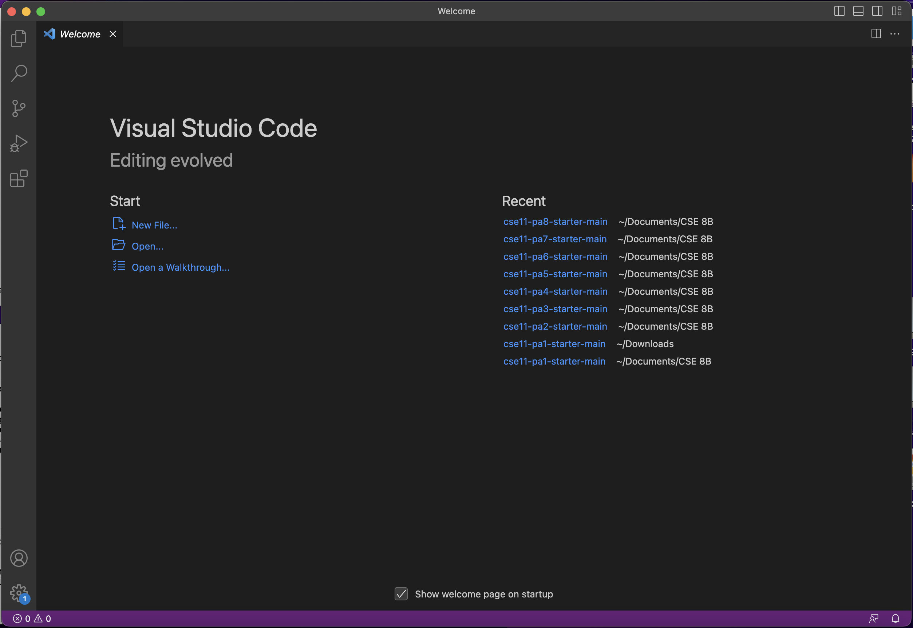
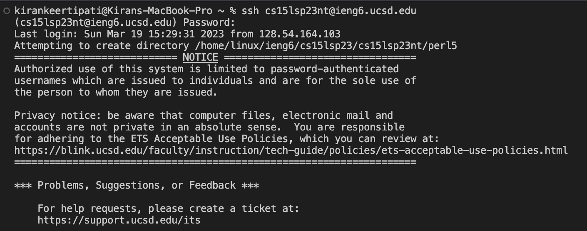
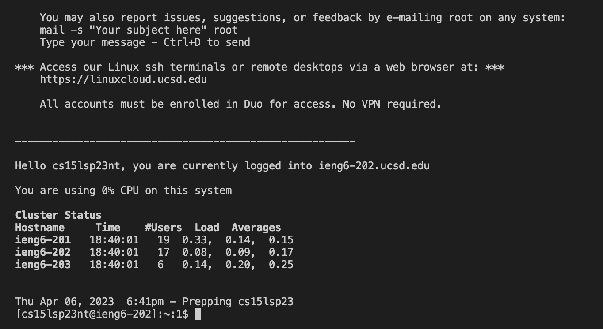
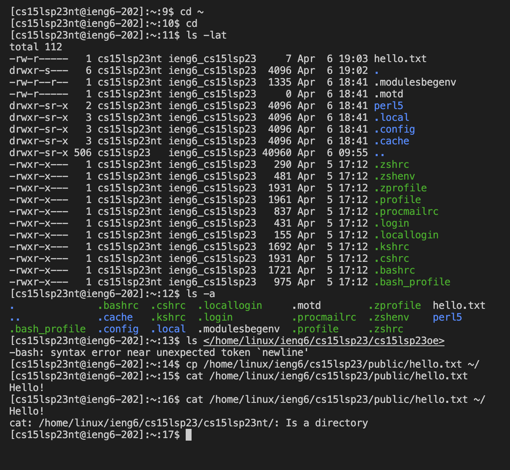

# Lab Report 1 #
## Installing VScode #
- To download VScode onto your laptop, you should click on this link [VScodeInstructions](https://code.visualstudio.com/) and follow the instructions according to the laptop you use.
- I had already downloaded VScode for a previous class, so I opened it on my laptop, checked whether it was an acceptable version and then I opened the welcome page.
- Below is the screenshot of the welcome page of my VScode:

## Remotely Connecting #
- Since I use a mac laptop I did not need to work with Bash on windows. For people who are using a windows device, git Bash is used to connect Git to your command line. So you would first download git using this link [DownloadGitForWindows](https://gitforwindows.org/) and then follow the instructions on this link [BashForWindows](https://stackoverflow.com/questions/42606837/how-do-i-use-bash-on-windows-from-the-visual-studio-code-integrated-terminal/50527994#50527994) so your terminal can use the git bash you just installed.
- Since I did not need to do the previous step, mac users like me should first open a terminal on VScode using Terminal then New Terminal on the menu bar.
- To connect remotely we need to type `$ ssh cs15lsp23zz@ieng6.ucsd.edu`, the zz after sp23 should be replaced by two letters that are specific to your username. You can find it by accessing your UCSD CSE15L course-specific account, and you can identify these letters from your username for that account.
- To connect to my course-specific CSE 15L I typed: `$ ssh cs15lsp23nt@ieng6.ucsd.edu`
- After typing this and entering, you may receive a message which will ask you if you want to continue connecting, type yes and enter
- You will then be asked for a Password, type in the password for your cs15sp23 account. (It may not look like the password is being typed out but finish typing it and press enter)
- Below is the screenshot of what you should expect to see if you were able to connect to the remote server:

## Trying Some Commands #
- Next we can try commands, I tried the following commands
1. `cd ~` (We do not get anything as an output because we are not working on a directory currectly)
2. `cd` (We do not get anything as an output because we are not working on a directory currectly)
3. `ls -lat` (We may receive an output similar to the one in my screenshot below)
4. `ls -a` (We may receive an output similar to the one in my screenshot below)
5. `ls </home/linux/ieng6/cs15lsp23/cs15lsp23oe>` (I used one of my lab group member's username for this part to check if it works)
6. `cp /home/linux/ieng6/cs15lsp23/public/hello.txt ~/`
7. `cat /home/linux/ieng6/cs15lsp23/public/hello.txt`
8. `cat /home/linux/ieng6/cs15lsp23/public/hello.txt ~/`
- Below I have attached a screenshot of the various outputs that you may get if you try the commands listed above

