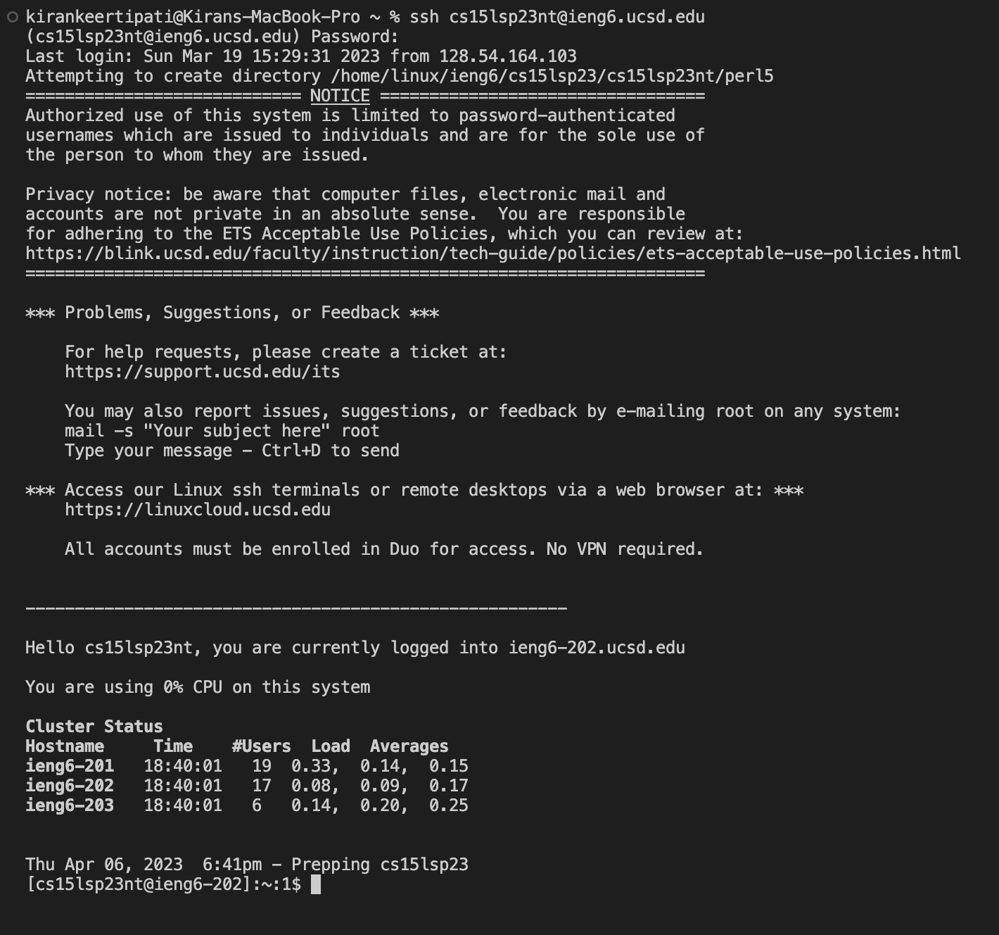

# Lab Report 1 #
## Installing VScode #
- I had already downloaded VScode for a previous class, so I opened it on my laptop, checked whether it was an acceptable version and then I opened the welcome page.
- Below is the screenshot of the welcome page of my VScode:

## Remotely Connecting #
- First open a terminal on VScode using Terminal then New Terminal on the menu bar.
- To connect remotely we need to type `$ ssh cs15lsp23nt@ieng6.ucsd.edu` (the two letters after sp23 are specific to your username)
- After typing this and entering, you may receive a message which will ask you if you want to continue connecting, type yes and enter
- You will then be asked for a Password, type in the password for your cs15sp23 account. (It may not look like the password is being types out but finish typing it and press enter)
- Below is the screenshot of what you should expect to see if you were able to connect to the remote server:

## Trying Some Commands #
