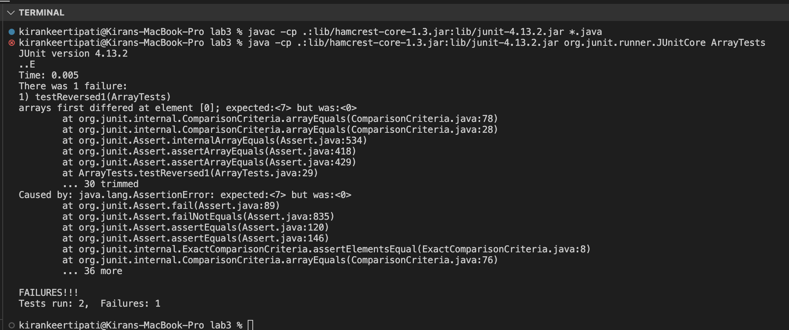
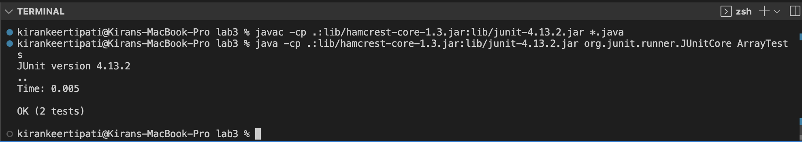

# Lab Report 2: Servers and Bugs

## Part 1:

## Part 2:

For this part of the lab report, I am going to explain the bugs in the reversed method in the file ArrayExamples.java

- A failure inducing input for this method was the following JUnit test:

    ```
    @Test
    public void testReversed1() {
      int[] input1 = { 6, 7 };  
      assertArrayEquals(new int[]{ 7, 6 }, ArrayExamples.reversed(input1));
    }
    ```
 
 
- A input that did not induce a failure for this method is the following JUnit test:

    ```
    @Test
    public void testReversed() {
      int[] input1 = { }; 
      assertArrayEquals(new int[]{ }, ArrayExamples.reversed(input1));
    }
    ```


- The system of the bug in this method, that is the output when I ran these two tests in JUnit:

  

- The bug in the code:

  - The code before the change (with the bug) :

    ```
    static int[] reversed(int[] arr) {
      int[] newArray = new int[arr.length];
      for(int i = 0; i < arr.length; i += 1) {
        arr[i] = newArray[arr.length - i - 1];
      }
      return arr;
    }
    ```
  
  
  - The code after the change (the bug was removed/fixed):

    ```
    static int[] reversed(int[] arr) {
      int[] newArray = new int[arr.length];    
      for(int i = 0; i < arr.length; i += 1) {   
        newArray[i] = arr[arr.length - i - 1];    
      }
      return newArray;    
    }
    ```
This reversed method was meant to create a new array and then copy the elements of the old array (arr) into the new array (newArray) in the reverse order. The initial version of the method with the bug, created the new array and set up the for loop to iterate through the array but instead of changing the each of the elements in newArray, it changed each of the elements in arr to the elements of newArray. This version then returned arr, instead of newArray.
So I noticed two errors in the implementation of the code:
- Firstly, the loop iterated through the wrong array and hence copied the elements from the newArray to arr, which was wrong.
- Secondly, it returned arr, instead of returning the newArray.
So, to fix these errors, I changed the code to now iterate through newArray and copy the elements from arr in the reversed order. I also ensured that the code returns newArray, which is the reversed version of arr.

When I run both these test cases after I changed the code I get the following output:



