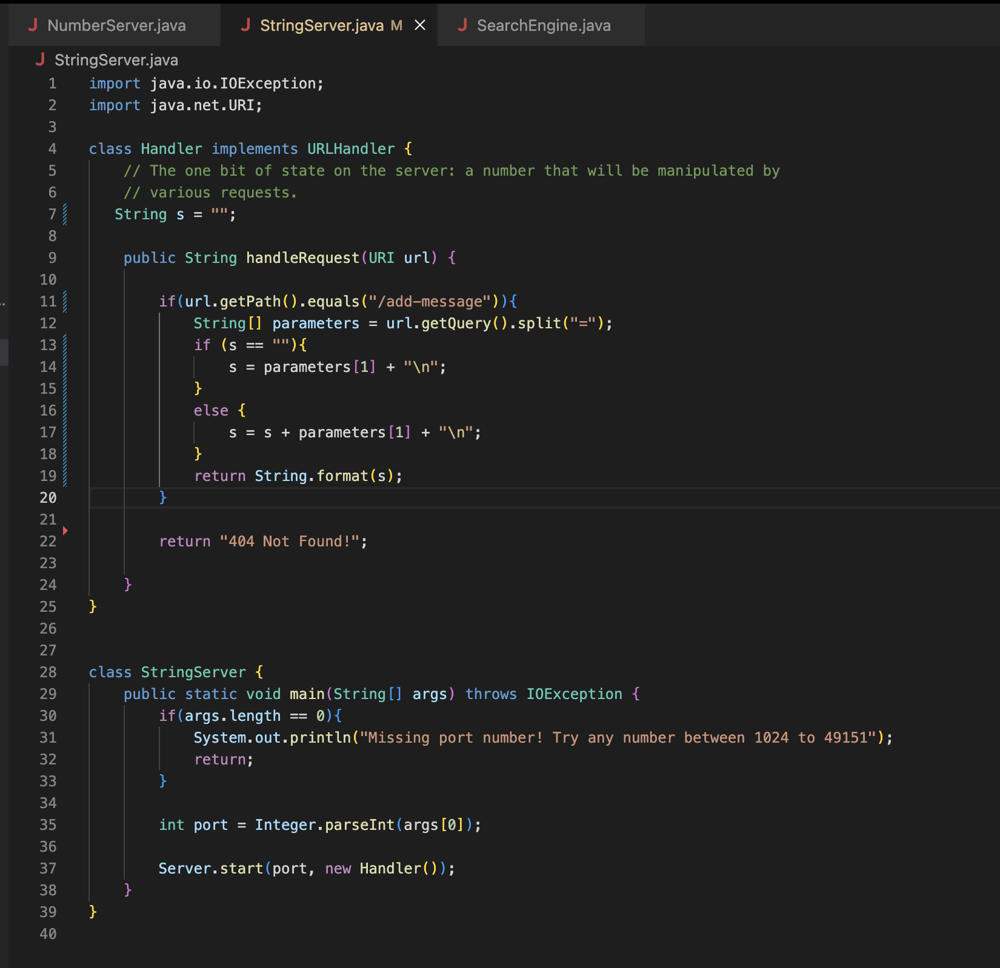
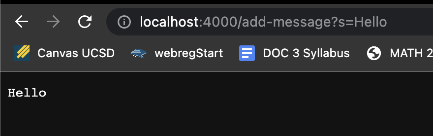
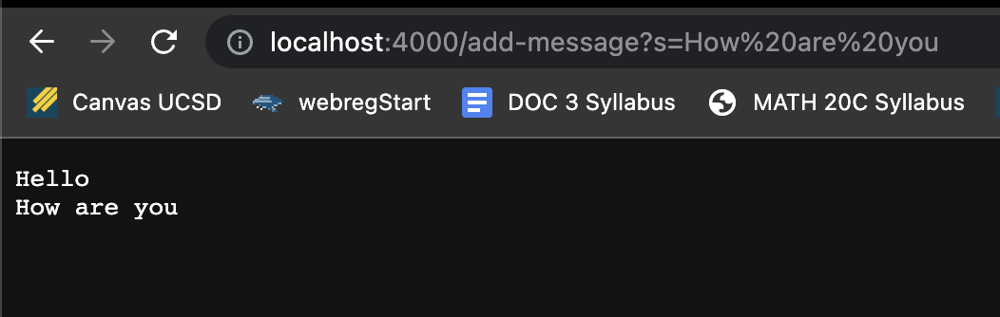

# Lab Report 2: Servers and Bugs

This lab report consists of the following:
1. Part 1: Building StringServer
2. Part 2: Identifying symptoms and inputs for a bug in lab 3
3. Part 3: Reflecting on something I learned from lab 2 or lab 3


## Part 1:


                                                        
Above is my code in `StringServer.java`. This code shows a string on the web browser. And concatinates the next string on the next line of the browser.


The above is a screenshot of the web browser when `/add-message?s=Hello` is passed in.

The methods that are called in my code are:
- `handleRequest` method that takes in a URL parameter called `url`, and returns a String.
- `main` method that takes in a String array as a parameter called `args` and returns nothing (void). It throws an `IOException` if the port is not given.

The arguments for `handleRequest` and the relevant fields are:
- An argument that this method takes in the above screenshot is: `/add-message?s=Hello`
- A relavent field for this method and this implementation is `s`, which is intitialized outside the method, but is updated within the method in the `if` branch.
- Another relavent field us the the String array `parameters`. This field is initialized in the array and splits the argument (the URI) in this case `/add-message?s=Hello` at the `=`. The second element in parameters is then used to change the value of `s`.

How the values of the fields of the class change:
- The field `s` is first initialized as `""`, then within the method with this specific argument it becomes  
```
`"Hello"` 
```



The above is a screenshot of the web browser when `/add-message?s=How Are You` is passed in after `/add-message?s=Hello` was passed in previously.

The methods that are called in my code are:
- `handleRequest` method that takes in a URL parameter called `url`, and returns a String.
- `main` method that takes in a String array as a parameter called `args` and returns nothing (void). It throws an `IOException` if the port is not given.

The arguments for `handleRequest` and the relevant fields are:
- An argument that this method takes in the above screenshot is: `/add-message?s=How Are You`
- A relavent field for this method and this implementation is `s`, which is intitialized outside the method, but is updated within the method in the `else` branch.
- Another relavent field us the the String array `parameters`. This field is initialized in the array and splits the argument (the URI) in this case `/add-message?s=How Are You` at the `=`. The second element in parameters is then used to change the value of `s`.


How the values of the fields of the class change:
- The field s is first initialized as `""`, then within the method with this specific argument it becomes  
```
`"Hello"`
`"How Are You"`
```
and a new line is added at the end


## Part 2:

For this part of the lab report, I am going to explain the bugs in the **reversed** method in the file `ArrayExamples.java`

- A failure inducing input for this method was the following JUnit test:

    ```
    @Test
    public void testReversed1() {
      int[] input1 = { 6, 7 };  
      assertArrayEquals(new int[]{ 7, 6 }, ArrayExamples.reversed(input1));
    }
    ```
    The above test case resulted in a failure because the method did not give us the right output for this test. This is further explained in the rest of Part 2.
 
 
 
- A input that did not induce a failure for this method is the following JUnit test:

    ```
    @Test
    public void testReversed() {
      int[] input1 = { }; 
      assertArrayEquals(new int[]{ }, ArrayExamples.reversed(input1));
    }
    ``` 
    This input did not result in a failure because an empty array was passed in, so it just returned an empty array as the output, which was what we expected this method to do for this particular test. Hence, even though the code has a bug, this output matched what was expected and the test does not fail.


- The symptom of the bug in this method, that is the output when I ran these two tests in JUnit:

  
   By observing the image, which denotes the output we can attempt to identify what caused the failure. We can see that the end of the output says that 2 tests ran, out of which one failed. To identify which test failed we can look at the top of the output which describes that there was 1 failure and this was caused by `testReversed1` . The output further tells us what was expected versus what was recieved. So, we can notice that it expected the element 7, if the method has worked correctly, but it instead recieved 0. Now that we have identified an issue in the output we can attempt to fix the bug.


- The bug in the code:

  - The code **before** the change (with the bug) :

    ```
    static int[] reversed(int[] arr) {
      int[] newArray = new int[arr.length];
      for(int i = 0; i < arr.length; i += 1) {
        arr[i] = newArray[arr.length - i - 1];
      }
      return arr;
    }
    ```
  
  
  - The code **after** the change (the bug was removed/fixed):

    ```
    static int[] reversed(int[] arr) {
      int[] newArray = new int[arr.length];    
      for(int i = 0; i < arr.length; i += 1) {   
        newArray[i] = arr[arr.length - i - 1];    
      }
      return newArray;    
    }
    ```
This reversed method was meant to create a new array and then copy the elements of the old array `arr` into the new array `newArray` in the reverse order.

The initial version of the method with the bug, created the new array and set up the for loop to iterate through the `arr` array but instead of changing the each of the elements in `newArray `, it changed each of the elements in `arr` to the elements of `newArray`. Hence, `arr` became an array with its elements equal to 0. This version then returned `arr`, instead of `newArray`.

So I noticed two errors in the implementation of the code:
- Firstly, the loop iterated through the wrong array and hence copied the elements from the `newArray` to `arr`, which was wrong.
- Secondly, it returned `arr`, instead of returning the `newArray`.

So, to fix these errors, I changed the code to now iterate through `newArray` and copy the elements from `arr` in the reversed order into `newArray`. I also ensured that the code returns `newArray`, which is the reversed version of `arr`.

When I run both these test cases after I changed the code I get the following output:


## Part 3:

In lab during week 2, I learned how to clone a repository using github desktop. This kind of hand-on work really helped me understand this important concept. After cloning the repository I had to build and run a server. This was interesting and very new because that was the first time I worked with created my own server. Especially learning about ports and localhost, and how the localhost is a domain that refers to the computer I am currently working on. While reading through the code in `NumberServer.java` I learned that we could use `String.format` to display what we wanted to appear on the browser. Since working with servers is very new to me, learning with this and working with it was interesting.
