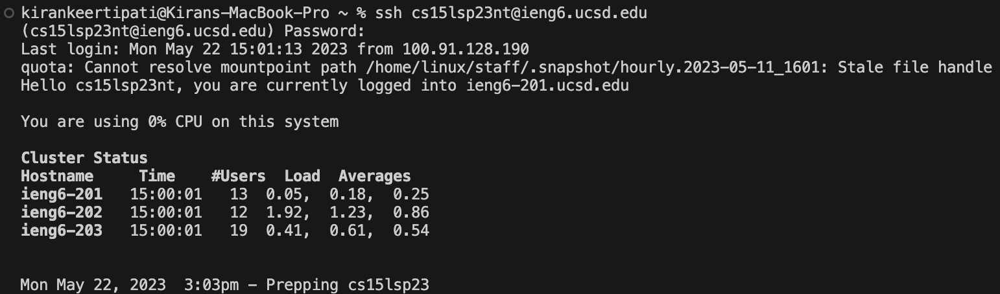
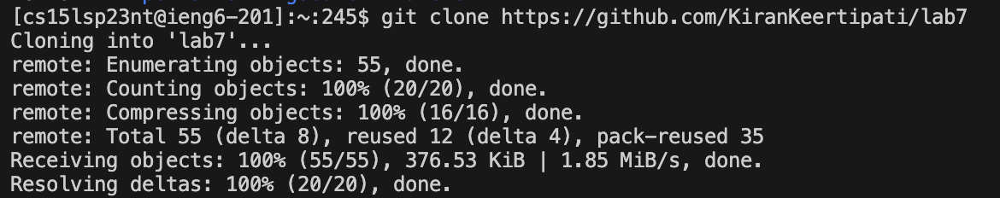
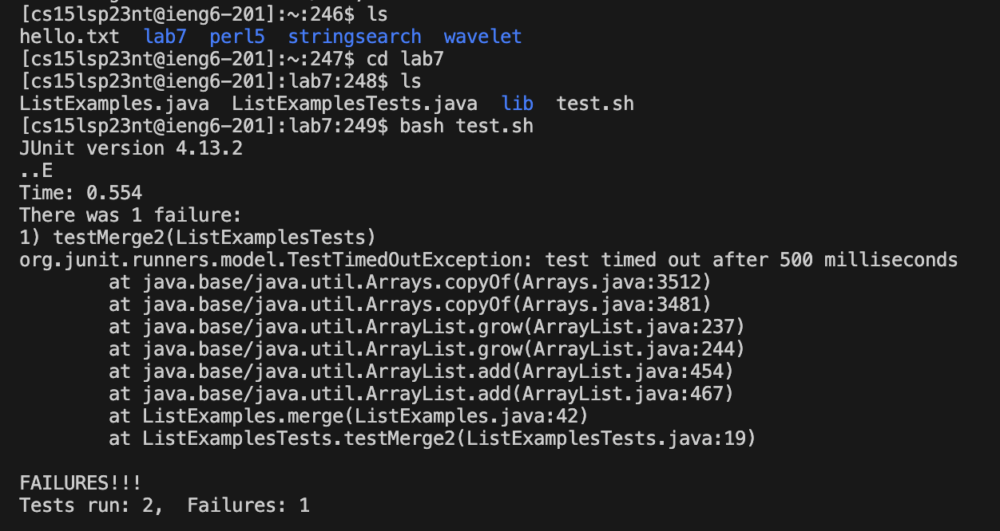
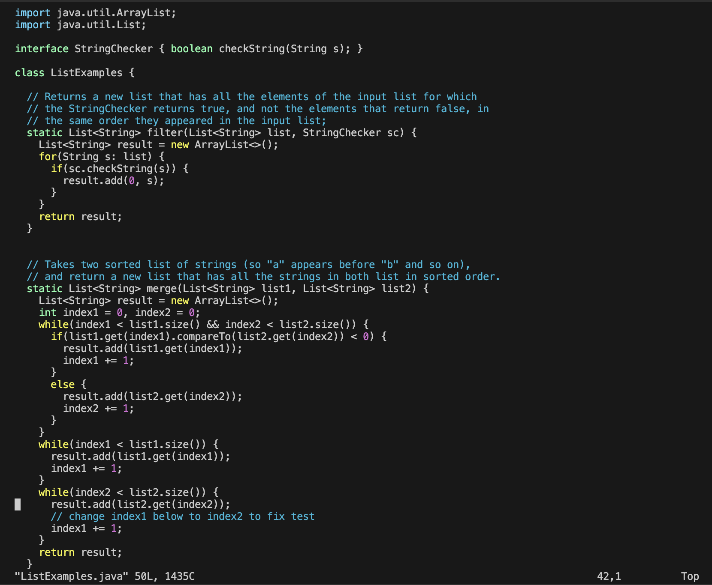
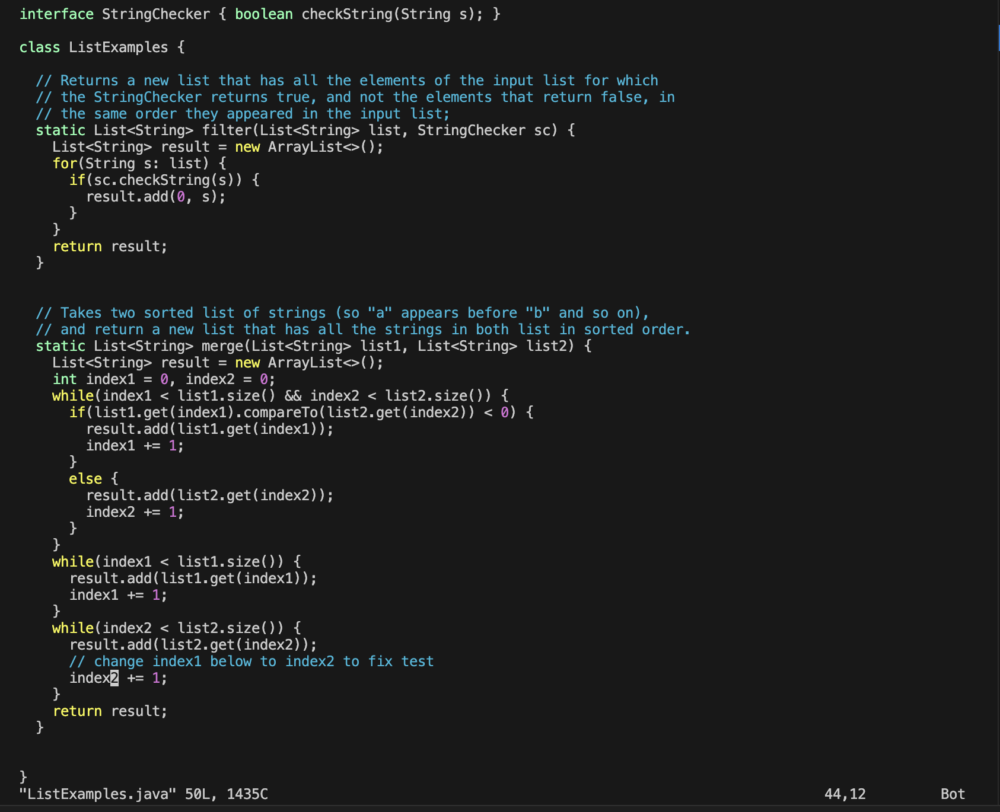
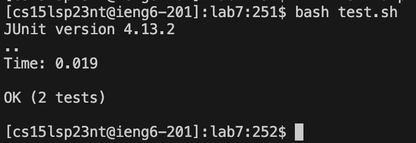
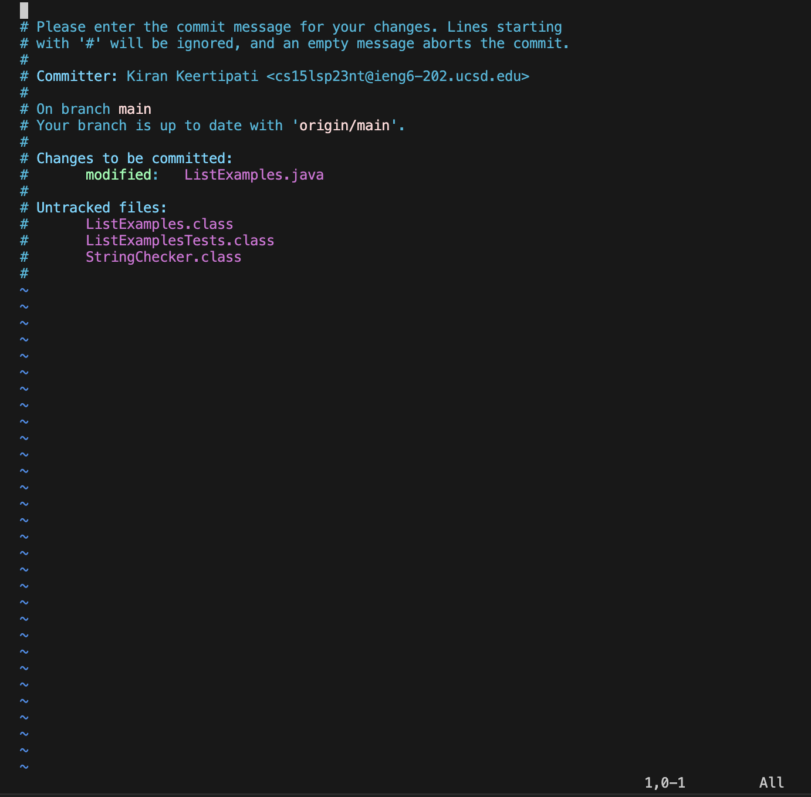
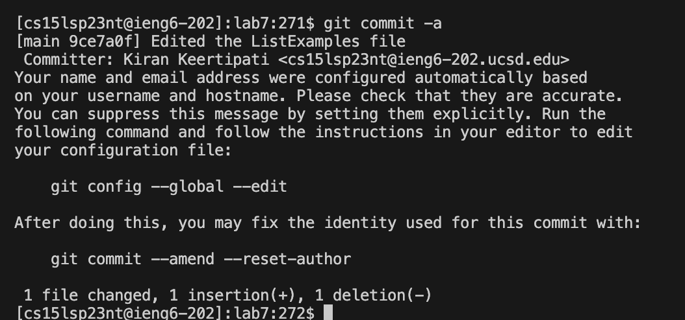

# Lab Report 4 #
For this lab we had to track steps 4 to 9 from the Week 7 lab and note down all the commands we used to do the tasks. The following are the steps:

### 4. Loging into your ieng6 account : #
To log in to my ieng6 account, I first opened a terminal and typed the following code: `ssh cs15lsp23nt@ucsd.edu`. I was then prompted to enter my password, which I did, then I pressed `<enter>` and I entered my account. The following was the results of the above steps:

### 5. Cloning the fork of the repository from your Github account #
To fork and clone the Github repository I did the following steps:
I went to the `https://github.com/ucsd-cse15l-s23/lab7` repository and forked it on GitHub. After this I opened the forked `lab7` repository on my GitHub account and copied the link from there. Then I went back to my terminal and typed `git clone` then using `<command>` and `<v>` I pasted the following: `https://github.com/KiranKeertipati/lab7`
Hence now the line read :`git clone https://github.com/KiranKeertipati/lab7` after which I pressed `<enter>`.
Below is the the input and the output of this step:

### 6. Run the tests, and demonstrating that they fail #
To do this step, typed the following keys and the resultant output is shown below: 
`ls` `<enter>` then `cd lab7` `<enter>` then `ls` `<enter>` then `bash test.sh`. These commands helped me navigate through my account and change the directory to lab7, and view the contents of lab7. After which I ran the tests using `bash test.sh`.

As the image shows, the tests fail before the file has been edited.

### 7. Edited the code using `vim` (changing index1 to index2)
To edit the code in `ListExamples.java` using `vim` I typed the following onto the terminal: `vim ListExamples.java`. This opened up the file as shown in the following picture. This is the unchanged version of the file:

To make the required edits that will make the tests pass I pressed the following keys:
- `<j><j><l><l><l><l><l><l><l><l><l><l><l>` (This helped me reach `index1` in the last while loop in merge, my cursor was now on the `1`.)
- `<x>` (This helped me delete the `1`)
- `<i> 2` (This helped me insert the `2` at the place my cursor was)
- `<esc>` (This helped me leave the insert mode)
- `:wq` (This helped me save and then quit, which took me back to my terminal)

After making the edits, I used the up arrow key`<up>`, to get `vim ListExamples.java` back onto the line after which I pressed on `<enter>`. I did this step to just ensure that the changes to my code were actually present and saved. The image below shows the edited file.

### 8. Run the tests, demonstrating that they now succeed #
I then retyped `bash test.sh` and then pressed on `<enter>` and the tests ran and passed. The image below shows the output that the tests ran:

### 9. Commit and push the resulting change to your Github account #

To do this I used `git commit -a` then `<enter>` and this opened up the following:

I then typed in the message I wanted to commit using the following keys:
`<i> Edited the ListExamples file` `<esc>` `:wq` this helped me type my message, then save and quit.
The following image was the result:

After this using `git push` I pushed my worked to GitHub.
