# Lab Report 5 #

## Part 1 - Debugging Scenario ##

### 1. Orginal Post of Student on Edstem: ###
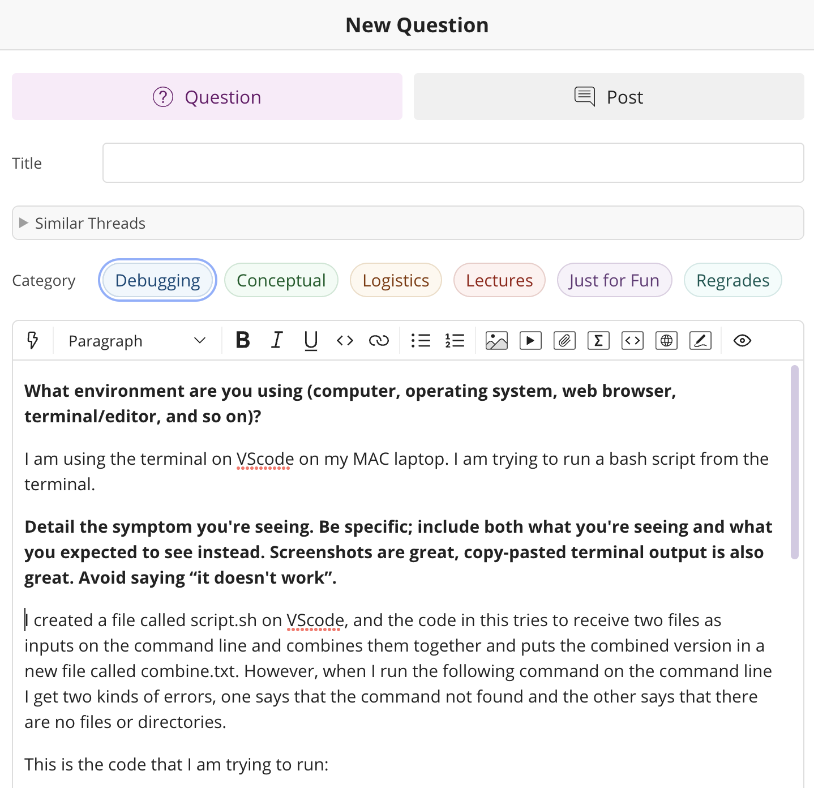

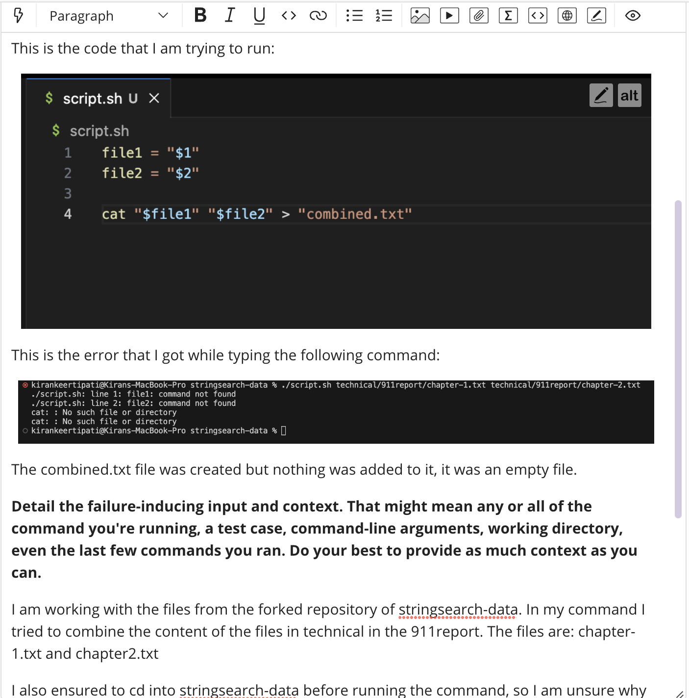

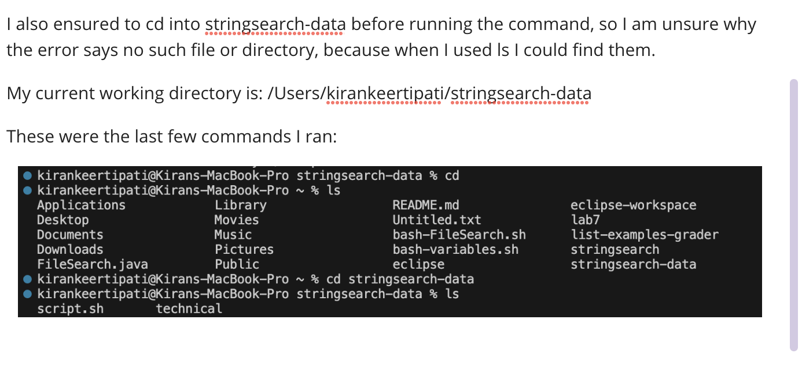

### 2. Response from a TA ###
Thanks for reaching out! I believe that the issue is with your bash script. Bash code usually requires specific puntuation and spacing, which is often easy to overlook. The assignment of your variables is probably where you went wrong. Specifically on lines 1 and 2 in `script.sh`. I believe that your spacing is wrong for those lines. The code should instead be: `file1="$1"` and `file2="$2"` on lines 1 and 2 respectively. That is, you should remove any spaces around the `=`. Apart from this your code and command look fine. Ensure that you are in the right directly when you run the command after making the required changes. Please feel free to reach out if you are still having trouble running the command.

### 3. The corrected code and correct output after trying what the TA suggested ###

The image below shows the corrected code in `script.sh`, after removing the unnecessary spacing around the `=` sign:

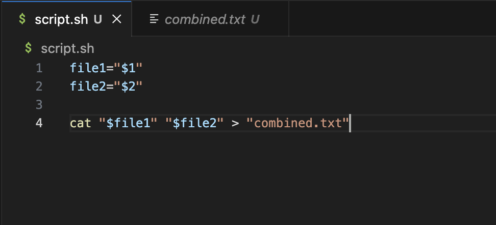

The image below shows the command that was used to execute the code in `script.sh`:

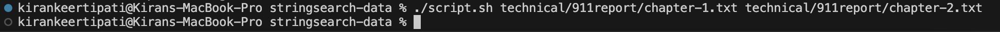

The image below shows the actual expected output with the corrected code. This `combined.txt` file now contains all the contents of the files `chapter-1.txt` and `chapter-2.txt` which are present in `stringsearch-data/technical/911report`:

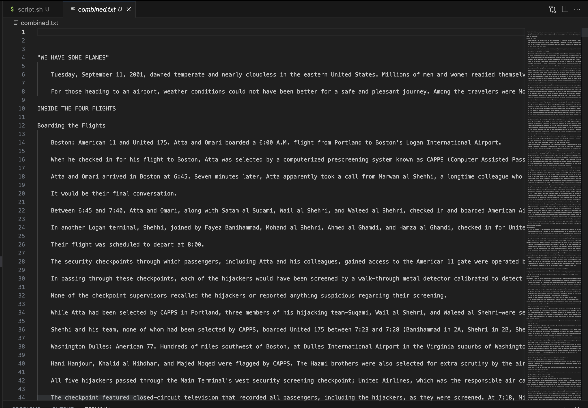

**The clear decription of the bug:** 

The bug was a mistake in the code written in `script.sh`. The code initially did not follow the syntax that is required for bash. The error was specifically on lines 1 and 2 when the student was trying to create the variables `file1` and `file2`. The student initially has the following code: `file1 = "$1"` amd `file2 = "$2` which is incorrect because there is extra spacing around the equal sign. This is what causes the error. The variables were hence never properly assigned and the code was wrong hence the student got the error that the files could not be found and that the command was wrong. But after fixing this bug to now have the code read `file1=$1` and `file2=$2` the errors no longer showed up in the terminal and the concatinated/combined contents of the two files was found in `combined.txt`.

### 4. Information needed for the setup: ###

**- The file & directory structure needed**
I used the fork of the `stringsearch-data` repository. I then created a new `script.sh` file in this repository and typed out the code in that. So the file/directory structure is very similar to `stringsearch-data` and is provided below:

 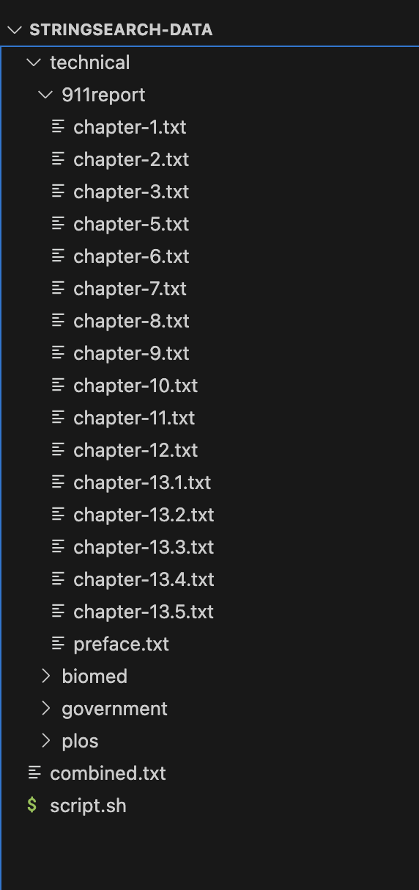

**- The contents of each file before fixing the bug**
This was the `script.sh` file with the bug (i.e unnecessary spacing around `=`):

 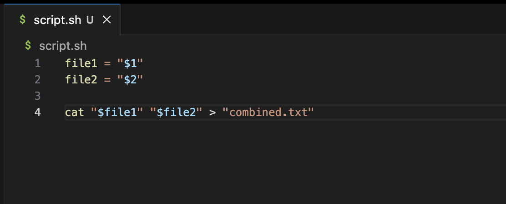

These were the contents of the two files that I utilized in my command. I wanted to combine the contents `technical/911report/chapter-1.txt` and `technical/911report/chapter-1.txt` into the file `combined.txt`.

`chapter-1.txt`:

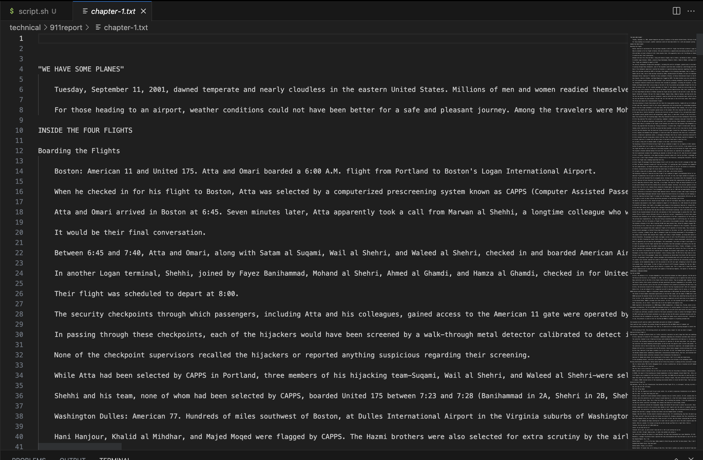

`chapter-2.txt`:

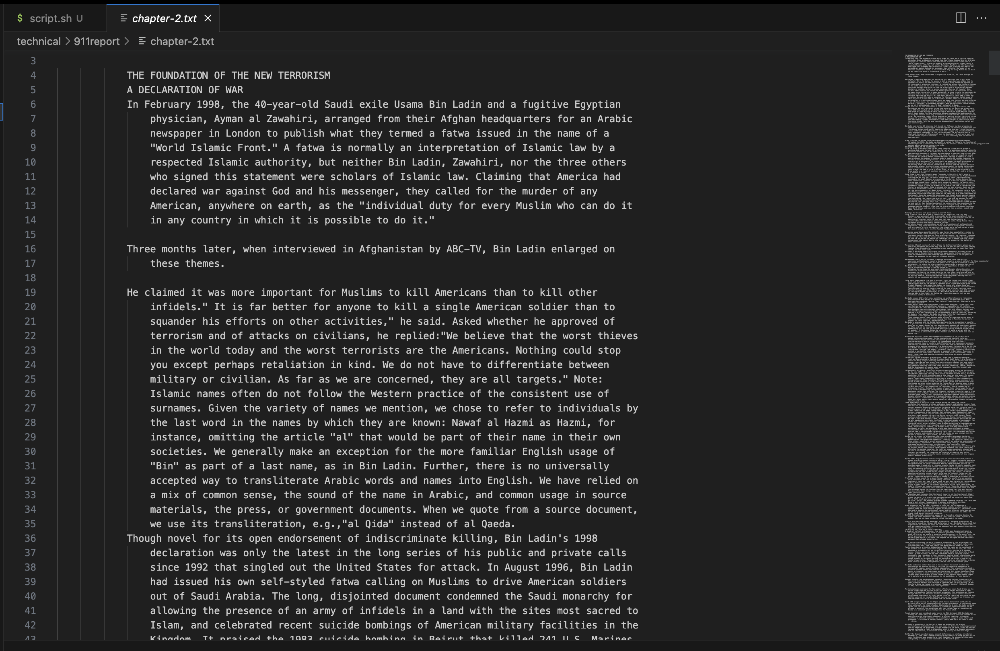

This was `combined.txt` when the bug was present. The code still created the file, but it remained empty, without the contents of `chapter-1.txt` and `chapter-1.txt`.

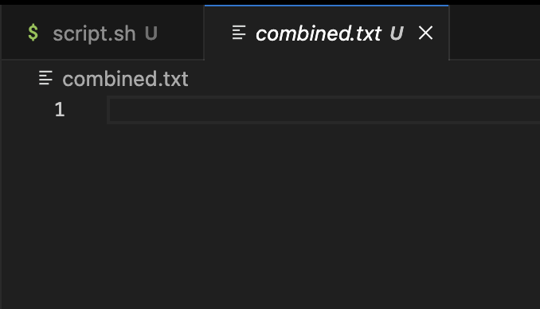

**- The full command line (or lines) you ran to trigger the bug**
After using `cd stringsearch-data` to enter the required directory, I typed out the following command on the command line:

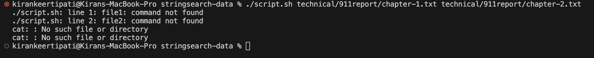

This was the exact command that I ran, which triggered the bug, The screenshot above also includes the resultant errors that came up when I ran the command.

**- A description of what to edit to fix the bug**

To fix the errors and to ensure that the contents of the two files are actually combined and added to `combined.txt`, I fixed the code in `script.sh`. The code in `script.sh` should be edited to match the following screenshot:

That is, the spaces around the `=` in lines 1 and 2 have to removed, since the initial code does not follow the right syntax required for bash to assign variables. After fixing this error, the command should run without errors, and the combined contents of the two text files will be added into the file `combined.txt`.
